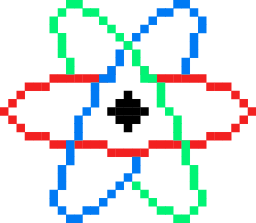

# qSim-cpp

[](https://app.codacy.com/app/haykkh/qSim?utm_source=github.com&utm_medium=referral&utm_content=haykkh/qSim&utm_campaign=Badge_Grade_Dashboard)

> Quantum computer simulator library



I'm building this to learn **C++** and **Quantum Information Theory** simultaneously, so don't be surprised if they're both wrong. Instead, feel free to [create a new issue](https://github.com/haykkh/qSim-cpp/issues/new) or a [new pull request](https://github.com/haykkh/qSim-cpp/pull/new/master) so you can rub in exactly what I did wrong in a concise, well commented manner.

Thanks **x**

## Installation

### Requirements

* C++14

### Instructions

Download or clone [qSim-cpp](https://github.com/haykkh/qSim-cpp) into ```some/directory/qSim```

## Usage example

```CPP
// A confused qubit
// confused.cpp

#include "qSim.h"

using namespace qsim;

int main() {
    // initialize a |0> qubit
    math::Ket qubit = states::z0;

    std::cout << "qubit:\n";
    qubit.print();

    // apply a Hadamard gate to qubit
    qubit *= gates::H;

    std::cout << "confused qubit:\n";
    qubit.print();
}
```

From this directory, compile ```confused.cpp``` using your compiler of choice:

```sh
$ g++ -std=c++14 -I some/directory/qSim/include confused.cpp -o confused
```

Then run your compiled file:

```sh
$ ./confused
```

Should output something like:

```sh
qubit:

| 1 |
| 0 |

confused qubit:

| 0.707 |
| 0.707 |

```

_For more examples and usage, please refer to the [examples](https://github.com/haykkh/qSim-cpp/tree/master/examples)._


## Release History

* 0.0.1
    * Work in progress

## Meta

Hayk Khachatryan – [chat w/ me](https://chat.hayk.io) – hi@hayk.io

Distributed under the MIT license. See ``LICENSE`` for more information.

[https://github.com/haykkh/](https://github.com/haykkh/)

## Contributing

1. Fork it (<https://github.com/haykkh/qSim-cpp/fork>)
2. Create your feature branch (`git checkout -b feature/fooBar`)
3. Commit your changes (`git commit -am 'Add some fooBar'`)
4. Push to the branch (`git push origin feature/fooBar`)
5. Create a new Pull Request

<!-- Markdown link & img dfn's -->
[npm-image]: https://img.shields.io/npm/v/datadog-metrics.svg?style=flat-square
[npm-url]: https://npmjs.org/package/datadog-metrics
[npm-downloads]: https://img.shields.io/npm/dm/datadog-metrics.svg?style=flat-square
[travis-image]: https://img.shields.io/travis/dbader/node-datadog-metrics/master.svg?style=flat-square
[travis-url]: https://travis-ci.org/dbader/node-datadog-metrics
[wiki]: https://github.com/yourname/yourproject/wiki