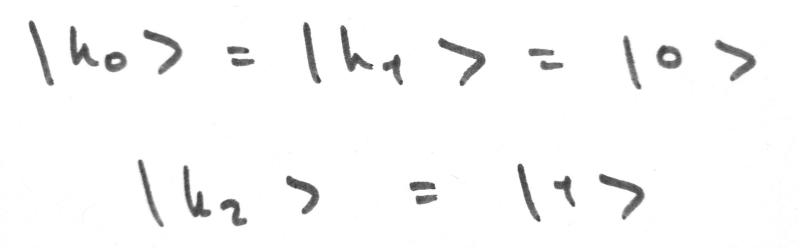
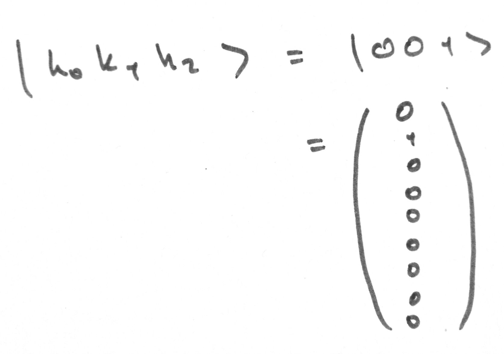
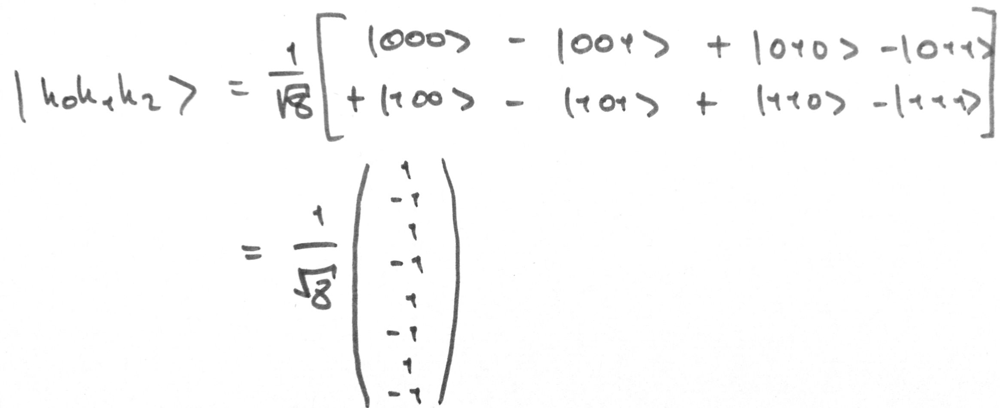

# Examples

* [eprpairs.cpp](#eprpairscpp)
* [hadamard.cpp](#hadamardcpp)


## eprpairs.cpp

A simple pair of entangled qubits in a shared Bell state

Demonstrates the creation of the shared state using two methods:
* Calling the preset value of __b00__ from ```states.h```
* Creating a circuit that entangles two qubits into a shared Bell state, __b00__

See [here](https://en.wikipedia.org/wiki/Bell_state) for more info

### Method

We have two qubits, __|A>__ and __|B>__, both in state __|0>__
<p></p>

Our system, __|AB>__, starts off in state __|00>__
<p></p>

We create a circuit that will entangle __|A>__ and __|B>__. First an Hadamard transform puts __|A>__ into an equally weighted superposition of __|0>__ and __|1>__, then __|A>__ acts asthe control qubit for a NOT gate applied to __|B>__. This circuit is equivalent to the matrix printed below
<p> </p>

After the circuit, our system is in state __|Φ⁺>__, or __b00__ in qSim
<p></p>

__|Φ⁺>__ is an equally weighted superposition of __|00>__ and __|11>__, so after measurement you get __|00>__ or __|11>__ with a probability of 0.5
<p></p>

```sh
$ ./eprpairs

Circuit Matrix:
| 0.707  0      0.707  0     |
| 0      0.707  0      0.707 |
| 0      0.707  0     -0.707 |
| 0.707  0     -0.707  0     |


System starting state:

| 1 |
| 0 |
| 0 |
| 0 |


Result from circuit:

| 0.707 |
| 0     |
| 0     |
| 0.707 |


Recalled variable result:

| 0.707 |
| 0     |
| 0     |
| 0.707 |


State after measurement:

| 0 |
| 0 |
| 0 |
| 1 |
```

## hadamard.cpp

Applies an Hadamard transform to 3 qubits

See [here](https://en.wikipedia.org/wiki/Hadamard_transform) for more info

### Method

We have three qubits, __|k0>__, __|k1>__, and __|k2>__; in states __|0>__, __|0>__, and __|1>__ respectively
<p></p>

Our system, __|k0k1k2>__, starts off in state __|001>__
<p></p>

We create a circuit that applies an Hadamard transform on all three qubits. This circuit is equivalent to the matrix printed below
<p> </p>


This circuit puts the system puts into equally weighted superposition of __|000>__, __|001>__, __|010>__, __|011>__, __|100>__, __|101>__, __|110>__, and __|111>__
<p></p>

As our system is in an equally weighted superposition, a measurement returns __|000>__, __|001>__, __|010>__, __|011>__, __|100>__, __|101>__, __|110>__, or __|111>__ with a probability of 0.125 each

```sh
$ /hadamard

Circuit matrix:
| 0.354   0.354   0.354   0.354   0.354   0.354   0.354   0.354 |
| 0.354  -0.354   0.354  -0.354   0.354  -0.354   0.354  -0.354 |
| 0.354   0.354  -0.354  -0.354   0.354   0.354  -0.354  -0.354 |
| 0.354  -0.354  -0.354   0.354   0.354  -0.354  -0.354   0.354 |
| 0.354   0.354   0.354   0.354  -0.354  -0.354  -0.354  -0.354 |
| 0.354  -0.354   0.354  -0.354  -0.354   0.354  -0.354   0.354 |
| 0.354   0.354  -0.354  -0.354  -0.354  -0.354   0.354   0.354 |
| 0.354  -0.354  -0.354   0.354  -0.354   0.354   0.354  -0.354 |


System starting state:

| 0 |
| 1 |
| 0 |
| 0 |
| 0 |
| 0 |
| 0 |
| 0 |


System state after circuit:

|  0.354 |
| -0.354 |
|  0.354 |
| -0.354 |
|  0.354 |
| -0.354 |
|  0.354 |
| -0.354 |


System state after measurement:

| 0 |
| 0 |
| 0 |
| 1 |
| 0 |
| 0 |
| 0 |
| 0 |
```

