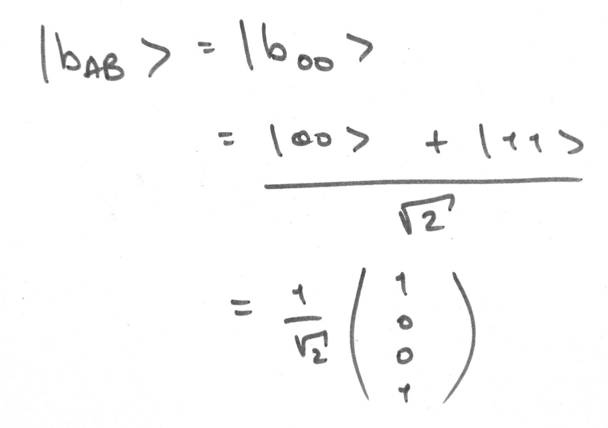

# Examples

## eprpairs.cpp

A simple pair of entangled qubits in a shared Bell state

Demonstrates the creation of the shared state using two methods:
* Calling the preset value of __b00__ from ```states.h```
* Creating a circuit that entangles two qubits into a shared Bell state, __b00__

### Method

We have two qubits, __|A>__ and __|B>__, both __|0>__


We create a circuit that will entangle __|A>__ and __|B>__. First an Hadamard transform puts __|A>__ into an equally weighted superposition of __|0>__ and __|1>__, then acts as a the control qubit for a NOT gate applied to __|B>__
 

Our system, __|AB>__ starts off in state


And after the circuit is in state __|Φ⁺>__, or __b00__ in qSim


__|Φ⁺>__ is an equally weighted superposition of __|00>__ and __|11>__, so after measurement you get __|00>__ 50% of the time and __|11>__ the other 50%


```sh
$ ./eprpairs.out

Circuit Matrix:
| 0.707  0       0.707   0     |
| 0      0.707   0       0.707 |
| 0      0.707   0      -0.707 |
| 0.707  0      -0.707   0     |


System starting state:

| 1 |
| 0 |
| 0 |
| 0 |


Our result is:

| 0.707 |
| 0     |
| 0     |
| 0.707 |


The true result is:

| 0.707 |
| 0     |
| 0     |
| 0.707 |


State after measurement:

| 0 |
| 0 |
| 0 |
| 1 |
```

