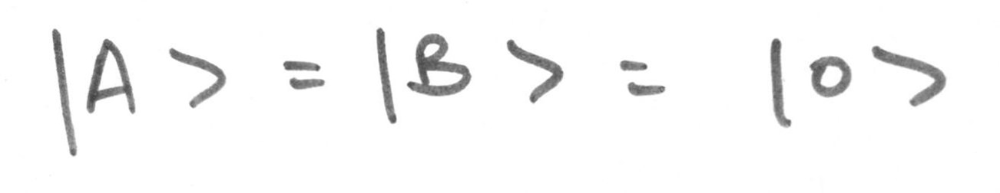
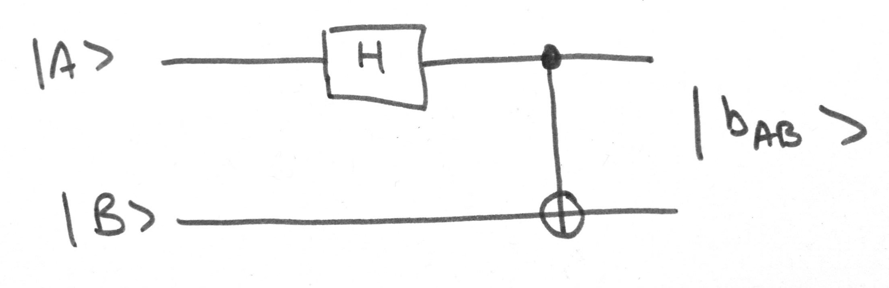

# eprpairs.cpp

A simple pair of entangled qubits in a shared Bell state

Demonstrates the creation of the shared state using two methods:

-   Calling the preset value of **b00** from `states.h`
-   Creating a circuit that entangles two qubits into a shared Bell state, **b00**

See [here](https://en.wikipedia.org/wiki/Bell_state) for more info

## Method

We have two qubits, **|A>** and **|B>**, both in state **|0>**

<p></p>

```cpp
// c++

Ket a = states::z0;
Ket b = states::z0;

Ket_ptr A = make_shared<Ket>(a);
Ket_ptr B = make_shared<Ket>(b);
```

Our system, **|AB>**, starts off in state **|00>**

<p></p>

```cpp
// c++

Ket ab = a * b;

cout << "\nSystem starting state:\n";
ab.print();
```

```sh
# sh

System starting state:

| 1 |
| 0 |
| 0 |
| 0 |
```

We create a circuit that will entangle **|A>** and **|B>**. First an Hadamard transform puts **|A>** into an equally weighted superposition of **|0>** and **|1>**, then **|A>** acts as the control qubit for a NOT gate applied to **|B>**. This circuit is equivalent to the matrix printed below

<p> </p>

```cpp
// c++

circuit::Circuit bell;

bell.setQubits({A, B});

bell.setCircuit({
    {
        {H, {A}}
    },
    {
        {CX, {A, B}}
    }
});

Matrix fc = bell.getFinalCircuit();

cout << "\nCircuit Matrix:\n";
fc.print();
```

```sh
# sh

Circuit Matrix:
| 0.707  0      0.707  0     |
| 0      0.707  0      0.707 |
| 0      0.707  0     -0.707 |
| 0.707  0     -0.707  0     |
```

After the circuit, our system is in state **|Φ⁺>**, or **b00** in qSim

<p></p>

```cpp
// c++

ab *= fc;

cout << "\nResult from circuit:\n";
ab.print(); 

Ket b00 = states::b00;

cout << "\nRecalled variable result:\n";    
b00.print();
```

```sh
# sh 

Result from circuit:

| 0.707 |
| 0     |
| 0     |
| 0.707 |


Recalled variable result:

| 0.707 |
| 0     |
| 0     |
| 0.707 |
```

**|Φ⁺>** is an equally weighted superposition of **|00>** and **|11>**, so after measurement you get **|00>** or **|11>** with a probability of 0.5

<p></p>

```cpp
ab.measure();

cout << "\nState after measurement:\n";
ab.print();
```

```sh
State after measurement:

| 0 |
| 0 |
| 0 |
| 1 |
```

## Sample run

```sh
$ ./eprpairs

Circuit Matrix:
| 0.707  0      0.707  0     |
| 0      0.707  0      0.707 |
| 0      0.707  0     -0.707 |
| 0.707  0     -0.707  0     |


System starting state:

| 1 |
| 0 |
| 0 |
| 0 |


Result from circuit:

| 0.707 |
| 0     |
| 0     |
| 0.707 |


Recalled variable result:

| 0.707 |
| 0     |
| 0     |
| 0.707 |


State after measurement:

| 0 |
| 0 |
| 0 |
| 1 |
```
