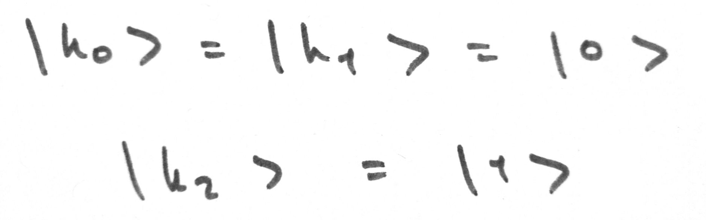
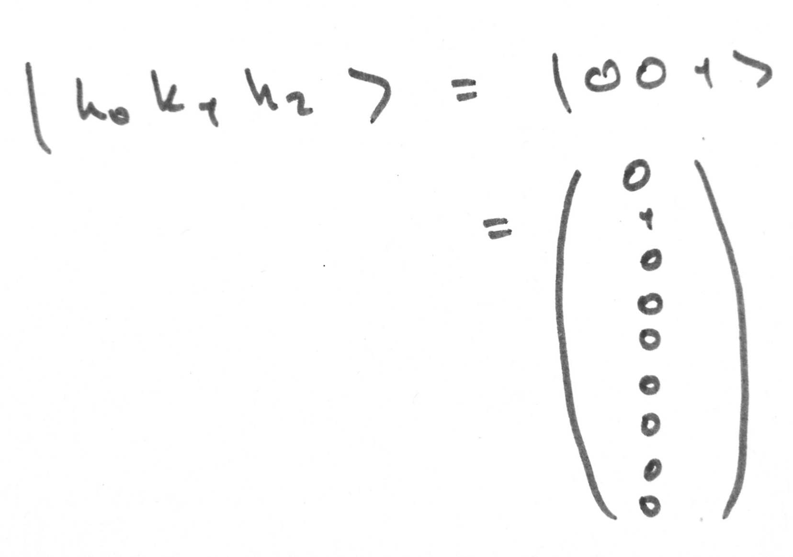
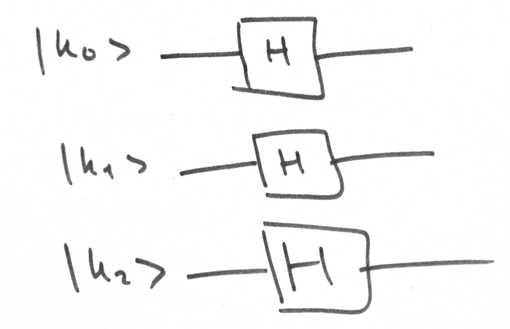
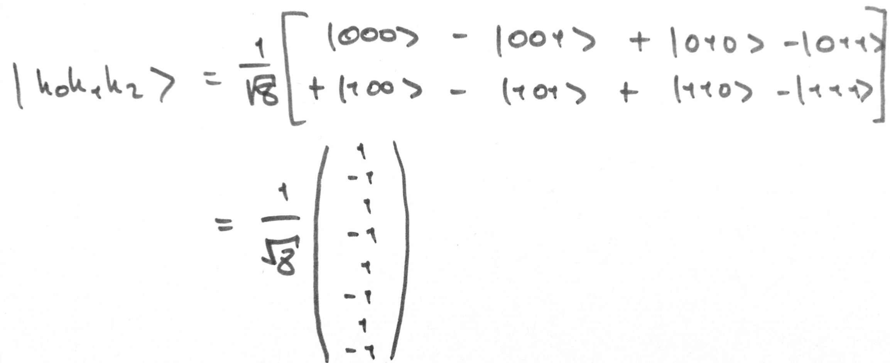

# hadamard.cpp

Applies an Hadamard transform to 3 qubits

See [here](https://en.wikipedia.org/wiki/Hadamard_transform) for more info

## Method

We have three qubits, __|k0>__, __|k1>__, and __|k2>__; in states __|0>__, __|0>__, and __|1>__ respectively
<p></p>

```cpp
// c++

Ket k0 = states::z0;
Ket k1 = states::z0;
Ket k2 = states::z1;

Ket_ptr q0 = make_shared<Ket>(k0);
Ket_ptr q1 = make_shared<Ket>(k1);
Ket_ptr q2 = make_shared<Ket>(k2);
```


Our system, __|k0k1k2>__, starts off in state __|001>__
<p></p>

```cpp
// c++

Ket state = k0 * k1 * k2;

cout << "\nSystem starting state:\n";
state.print();
```
```sh
# sh

System starting state:

| 0 |
| 1 |
| 0 |
| 0 |
| 0 |
| 0 |
| 0 |
| 0 |
```

We create a circuit that applies an Hadamard transform on all three qubits. This circuit is equivalent to the matrix printed below
<p> </p>

```cpp
// c++

vector<Ket_ptr> qubits = {q0, q1, q2};
Matrix H = gates::H;

circuit::Circuit hadamard;

hadamard.setQubits(qubits);

circuit::schematic scheme;

circuit::momentScheme moment;

for (auto i : qubits) {
    moment.push_back({H, {i}});
};

scheme = {moment};

hadamard.setCircuit(scheme);

Matrix fc = hadamard.getFinalCircuit();


cout << "\nCircuit matrix:\n";
fc.print();
```
```sh
# sh 

Circuit matrix:
| 0.354   0.354   0.354   0.354   0.354   0.354   0.354   0.354 |
| 0.354  -0.354   0.354  -0.354   0.354  -0.354   0.354  -0.354 |
| 0.354   0.354  -0.354  -0.354   0.354   0.354  -0.354  -0.354 |
| 0.354  -0.354  -0.354   0.354   0.354  -0.354  -0.354   0.354 |
| 0.354   0.354   0.354   0.354  -0.354  -0.354  -0.354  -0.354 |
| 0.354  -0.354   0.354  -0.354  -0.354   0.354  -0.354   0.354 |
| 0.354   0.354  -0.354  -0.354  -0.354  -0.354   0.354   0.354 |
| 0.354  -0.354  -0.354   0.354  -0.354   0.354   0.354  -0.354 |
```


This circuit puts the system puts into equally weighted superposition of __|000>__, __|001>__, __|010>__, __|011>__, __|100>__, __|101>__, __|110>__, and __|111>__
<p></p>

```cpp
// c++

state *= fc;

cout << "\nSystem state after circuit:\n";
state.print();
```
```sh
# sh

System state after circuit:

|  0.354 |
| -0.354 |
|  0.354 |
| -0.354 |
|  0.354 |
| -0.354 |
|  0.354 |
| -0.354 |
```


As our system is in an equally weighted superposition, a measurement returns __|000>__, __|001>__, __|010>__, __|011>__, __|100>__, __|101>__, __|110>__, or __|111>__ with a probability of 0.125 each

```cpp
// c++

state.measure();

cout << "\nSystem state after measurement:\n";
state.print();
```
```sh
# sh

System state after measurement:

| 0 |
| 0 |
| 0 |
| 1 |
| 0 |
| 0 |
| 0 |
| 0 |
```

## Sample run

```sh
$ /hadamard

Circuit matrix:
| 0.354   0.354   0.354   0.354   0.354   0.354   0.354   0.354 |
| 0.354  -0.354   0.354  -0.354   0.354  -0.354   0.354  -0.354 |
| 0.354   0.354  -0.354  -0.354   0.354   0.354  -0.354  -0.354 |
| 0.354  -0.354  -0.354   0.354   0.354  -0.354  -0.354   0.354 |
| 0.354   0.354   0.354   0.354  -0.354  -0.354  -0.354  -0.354 |
| 0.354  -0.354   0.354  -0.354  -0.354   0.354  -0.354   0.354 |
| 0.354   0.354  -0.354  -0.354  -0.354  -0.354   0.354   0.354 |
| 0.354  -0.354  -0.354   0.354  -0.354   0.354   0.354  -0.354 |


System starting state:

| 0 |
| 1 |
| 0 |
| 0 |
| 0 |
| 0 |
| 0 |
| 0 |


System state after circuit:

|  0.354 |
| -0.354 |
|  0.354 |
| -0.354 |
|  0.354 |
| -0.354 |
|  0.354 |
| -0.354 |


System state after measurement:

| 0 |
| 0 |
| 0 |
| 1 |
| 0 |
| 0 |
| 0 |
| 0 |
```

