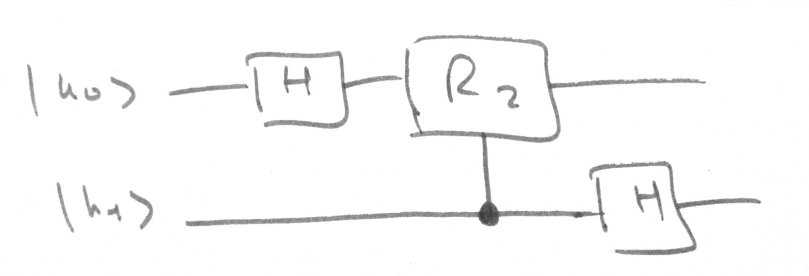
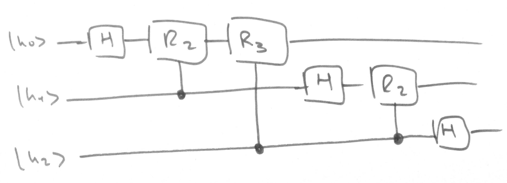
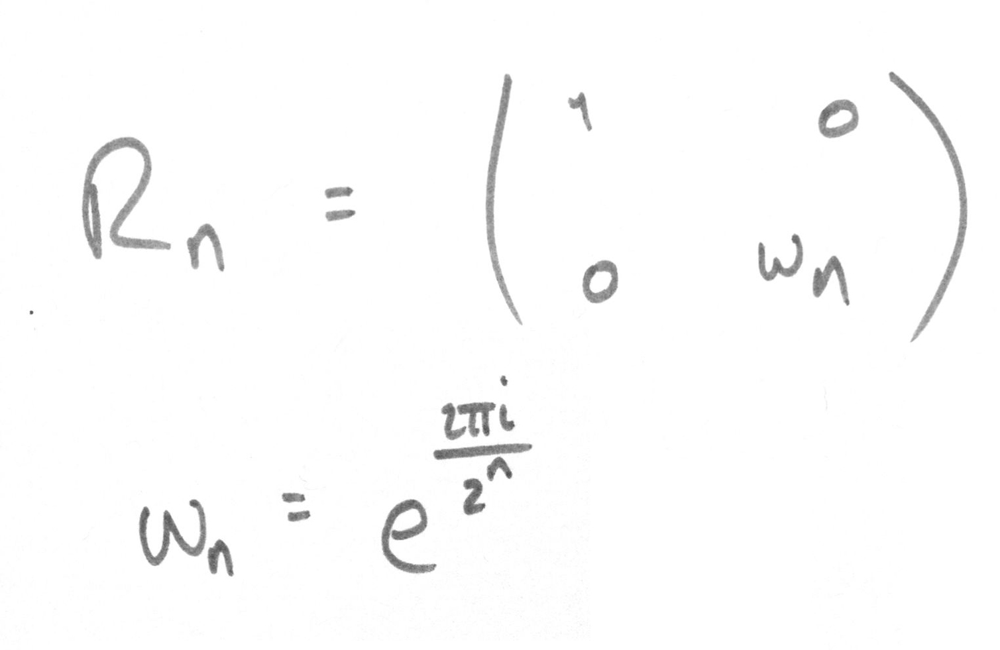

# QFT.cpp

Applies quantum Fourier transforms of size 2, 3, and 4

See [here](https://en.wikipedia.org/wiki/Quantum_Fourier_transform) for more info

## Method

For a system of 2 qubits, our circuit is
<p></p>

```cpp
cout << "2 qubit QFT matrix:\n\n";
Matrix twoQFT = gates::QFT(4);
twoQFT.print();
```
```sh
2 qubit QFT matrix:

| 0.5   0.5    0.5   0.5  |
| 0.5   0.5i  -0.5  -0.5i |
| 0.5  -0.5    0.5  -0.5  |
| 0.5  -0.5i  -0.5   0.5i |
```

For a system of 3 qubits
<p></p>

```cpp
cout << "\n3 qubit QFT matrix:\n\n";
Matrix threeQFT = gates::QFT(8);
threeQFT.print();
```
```sh
3 qubit QFT matrix:

| 0.354        0.354       0.354         0.354       0.354       0.354        0.354         0.354      |
| 0.354    0.25 + 0.25i    0.354i   -0.25 + 0.25i   -0.354   -0.25 - 0.25i   -0.354i    0.25 + -0.25i  |
| 0.354        0.354i     -0.354        -0.354i      0.354       0.354i      -0.354        -0.354i     |
| 0.354   -0.25 + 0.25i   -0.354i    0.25 + 0.25i   -0.354    0.25 + -0.25i   0.354i   -0.25 + -0.25i  |
| 0.354       -0.354       0.354        -0.354       0.354      -0.354        0.354        -0.354      |
| 0.354   -0.25 - 0.25i    0.354i    0.25 - 0.25i   -0.354    0.25 + 0.25i   -0.354i   -0.25 + 0.25i   |
| 0.354       -0.354i     -0.354         0.354i      0.354      -0.354i      -0.354         0.354i     |
| 0.354    0.25 - 0.25i   -0.354i   -0.25 - 0.25i   -0.354   -0.25 + 0.25i    0.354i    0.25 + 0.25i   |
```

Where Rn is a controlled [phase gate](https://en.wikipedia.org/wiki/Quantum_gate#Phase_shift_gates)
<p></p>


## Sample run

```sh
$ ./qft

2 qubit QFT matrix:

| 0.5   0.5    0.5   0.5  |
| 0.5   0.5i  -0.5  -0.5i |
| 0.5  -0.5    0.5  -0.5  |
| 0.5  -0.5i  -0.5   0.5i |


System starting state:

| 1 |
| 0 |
| 0 |
| 0 |


System state after circuit:

| 0.5 |
| 0.5 |
| 0.5 |
| 0.5 |


System state after measurement:

| 0 |
| 1 |
| 0 |
| 0 |


3 qubit QFT matrix:

| 0.354        0.354       0.354         0.354       0.354       0.354        0.354         0.354      |
| 0.354    0.25 + 0.25i    0.354i   -0.25 + 0.25i   -0.354   -0.25 - 0.25i   -0.354i    0.25 + -0.25i  |
| 0.354        0.354i     -0.354        -0.354i      0.354       0.354i      -0.354        -0.354i     |
| 0.354   -0.25 + 0.25i   -0.354i    0.25 + 0.25i   -0.354    0.25 + -0.25i   0.354i   -0.25 + -0.25i  |
| 0.354       -0.354       0.354        -0.354       0.354      -0.354        0.354        -0.354      |
| 0.354   -0.25 - 0.25i    0.354i    0.25 - 0.25i   -0.354    0.25 + 0.25i   -0.354i   -0.25 + 0.25i   |
| 0.354       -0.354i     -0.354         0.354i      0.354      -0.354i      -0.354         0.354i     |
| 0.354    0.25 - 0.25i   -0.354i   -0.25 - 0.25i   -0.354   -0.25 + 0.25i    0.354i    0.25 + 0.25i   |


System starting state:

| 1 |
| 0 |
| 0 |
| 0 |
| 0 |
| 0 |
| 0 |
| 0 |


System state after circuit:

| 0.354 |
| 0.354 |
| 0.354 |
| 0.354 |
| 0.354 |
| 0.354 |
| 0.354 |
| 0.354 |


System state after measurement:

| 0 |
| 0 |
| 0 |
| 1 |
| 0 |
| 0 |
| 0 |
| 0 |
```
